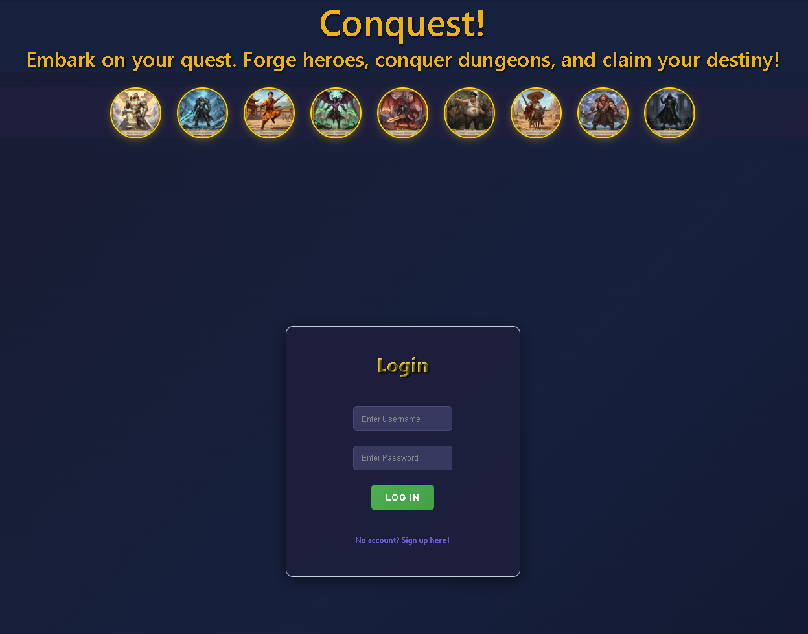

# Conquest BE

## Description

Conquest is a fantasy combat web application where users create heroes then battle monsters and other players in a dynamic arena. The app features hero management and strategic combat, all wrapped in a modern, interactive UI.

## Getting Started
- **Repo** [Github Repo](https://github.com/Buru7734/Conquest-BanckEnd)
- **Deployed App:** [Link to your deployed app](https://conquest-banckend-production.up.railway.app)
- **Planning Materials:** [Link to your planning docs](https://trello.com/b/ZaHKZpcn/ga-unit-4-project)

## Technologies Used

- Python (Django)
- PostgreSQL
- Django REST Framework
- JWT Authentication
- React (Frontend)
- CSS/Styled Components

## Attributions

- [Django REST Framework](https://www.django-rest-framework.org/)
- [Simple JWT](https://django-rest-framework-simplejwt.readthedocs.io/en/latest/)
- [React](https://react.dev/)
- [PostgreSQL](https://www.postgresql.org/)

## Next Steps

- Expand hero classes and add abilities
- Integrate leaderboards and achievements
- Mobile app version
- Enhanced dungeon exploration features (Loot drops!)